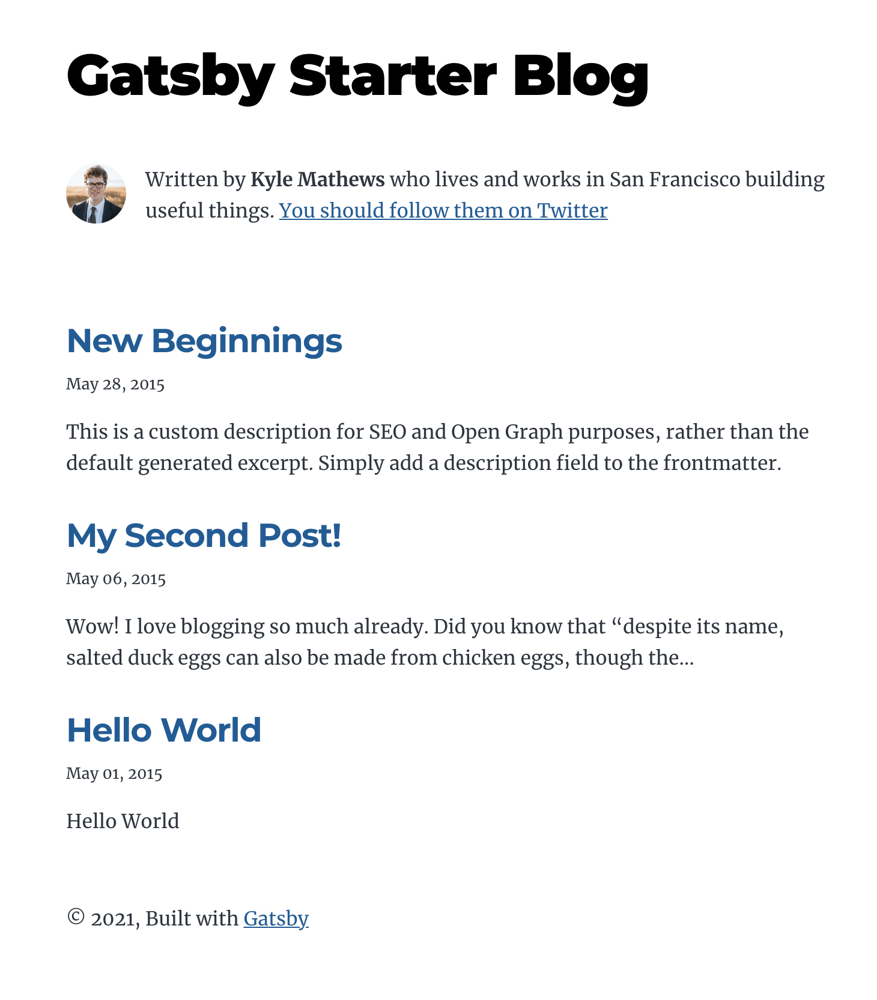

### 1. 일단 만들어보자

`개츠비`는 [npm](https://www.npmjs.com/)을 통해 설치할 수 있으며, [nodejs](https://nodejs.org/)와 함께 설치되기 때문에 미리 설치되어 있는 것을 가정하고 시작한다.
맥에서 작업하며 폴더는 임의로 설정 가능하니 적당히 바꿔서 작업하면 된다.

```
loel@loels-MacBook-Pro > ~/Documents/blog > sudo npm install -g gatsby-cli
loel@loels-MacBook-Pro > ~/Documents/blog > gatsby new {루트 경로} {스타터 링크}
```

사실 아주 기초부터 시작하면 좋기는 한데, 너무 기능이 없으면 블로그를 구축하다가 진 빠져서 못할까봐 스타터를 사용했다.

실제로 아래와 같이 수행했고, 다음과 같은 결과가 나왔다.

```
loel@loels-MacBook-Pro > ~/Documents/blog > gatsby new loelheim https://github.com/gatsbyjs/gatsby-starter-blog
info Creating new site from git: https://github.com/gatsbyjs/gatsby-starter-blog.git

Cloning into 'loelheim'...

...

info Initialising git in loelheim

hint: Using 'master' as the name for the initial branch. This default branch name
hint: is subject to change. To configure the initial branch name to use in all
hint: of your new repositories, which will suppress this warning, call:
hint:
hint: 	git config --global init.defaultBranch <name>
hint:
hint: Names commonly chosen instead of 'master' are 'main', 'trunk' and
hint: 'development'. The just-created branch can be renamed via this command:
hint:
hint: 	git branch -m <name>
info Create initial git commit in loelheim
info
Your new Gatsby site has been successfully bootstrapped. Start developing it by running:

  cd loelheim
  gatsby develop
```

마스터 브랜치를 초기 브랜치로 사용하며, 변경 대상이라고는 하는데 왜 그런지는 모르겠다.
페이지가 만들어졌고 `loelheim - 루트 폴더`로 이동해서 `gatsby develop`을 치면 로컬에서 블로그가 동작한다는 내용을 포함한다.

생성된 프로젝트의 구조는 다음과 같다.

```
├── LICENSE
├── README.md
├── content
│   └── blog
│       ├── hello-world
│       │   ├── index.md
│       │   └── salty_egg.jpg
│       ├── my-second-post
│       │   └── index.md
│       └── new-beginnings
│           └── index.md
├── gatsby-browser.js
├── gatsby-config.js
├── gatsby-node.js
├── package-lock.json
├── package.json
├── src
│   ├── components
│   │   ├── bio.js
│   │   ├── layout.js
│   │   └── seo.js
│   ├── images
│   │   ├── gatsby-icon.png
│   │   └── profile-pic.png
│   ├── normalize.css
│   ├── pages
│   │   ├── 404.js
│   │   ├── index.js
│   │   └── using-typescript.tsx
│   ├── style.css
│   └── templates
│       └── blog-post.js
└── static
    ├── favicon.ico
    └── robots.txt
```

`package.json`의 `scripts` 부분을 보면 `start`에 `gatsby develop`을 기본으로 넣어놨으니 `npm start`로 실행하는게 더 좋은 것 같다.
아무런 수정 없이 블로그를 로컬에서 구동하면 아래와 같은 메시지가 뜬다.

```
loel@loels-MacBook-Pro > ~/Documents/blog/loelheim > npm start

> gatsby-starter-blog@0.1.0 start
> gatsby develop

...

You can now view gatsby-starter-blog in the browser.

  http://localhost:8000/

View GraphiQL, an in-browser IDE, to explore your site's data and schema

  http://localhost:8000/___graphql

Note that the development build is not optimized.
To create a production build, use gatsby build

success Building development bundle - 12.481s
success Writing page-data.json files to public directory - 0.061s - 3/8 131.04/s
```

블로그를 로컬에서 구동하고 [http://localhost:8000](http://localhost:8000)으로 들어가면 아래와 같이 블로그에 접속할 수 있다.



당연히 로컬 환경이기 때문에 외부에 배포를 해야 외부에서 볼 수 있으며, 외부에 배포해야 할 때는 `npm serve`로 빌드하고 Github나 별도 호스팅 서비스에 등록해야 접근 가능하다.

### 2. 뭔가 쉬운데 허전해

`개츠비`에서는 다양한 형태의 플러그인과 스타터를 지원하며, 몇 차례 검색을 해보니 한국인 분들이 스타터를 몇 개 개발해서 공유해주셨다.

- https://github.com/zoomkoding/zoomkoding-gatsby-blog
- https://github.com/JaeYeopHan/gatsby-starter-bee
- https://github.com/devHudi/gatsby-starter-hoodie

다만 아쉽게도 작성일 기준 최신 버전 (4.2.0)에서는 위에 언급한 어떠한 스타터도 정상적으로 동작하지 않는다.

```
loel@loels-MacBook-Pro > ~/Documents/blog/loelheim > gatsby -v
Gatsby CLI version: 4.2.0
Gatsby version: 4.2.0
  Note: this is the Gatsby version for the site at: /Users/loel/Documents/blog/loelheim
```

### 3. 그럼 어쩌나 ... 직접 만들어야지

최신 버전이 나온데에는 그만한 이유가 있다는 생각에 다운그레이드나 프로젝트 포크를 사용하지 않았다.
대신에 스타터나 자료를 참고하여 필요한 기능을 추가할 예정이다.